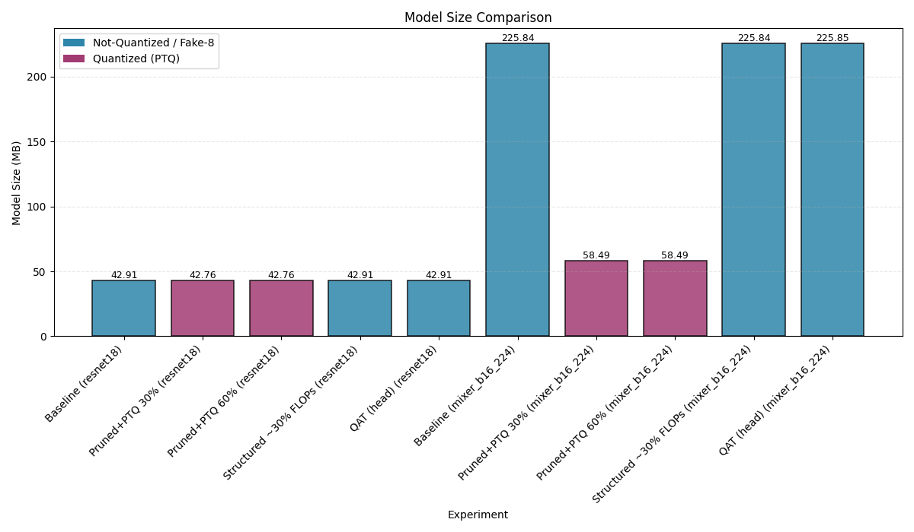
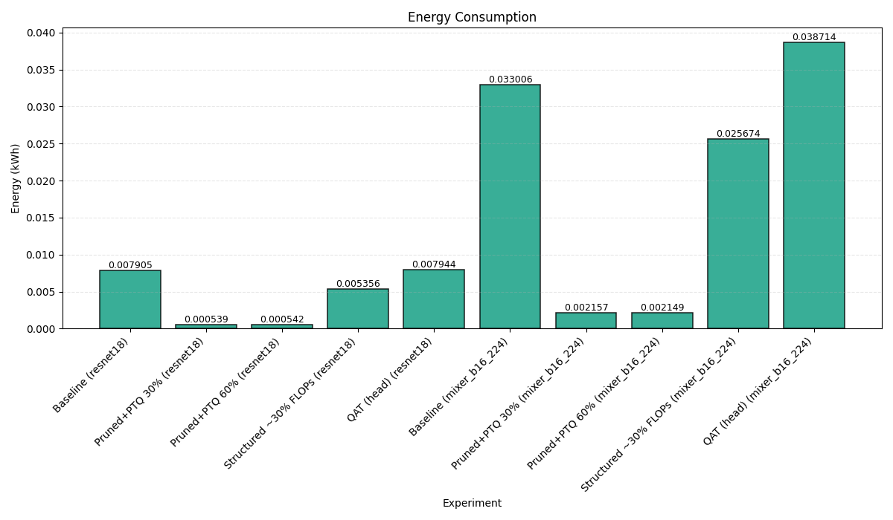
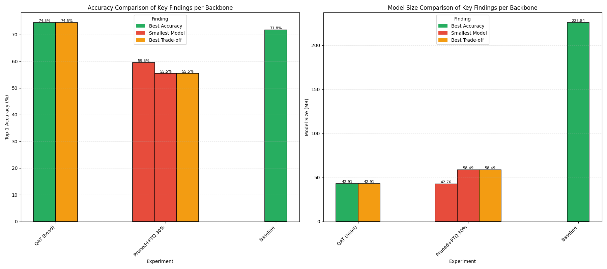

# Pruning & Quantization under Energy Constraints

A comprehensive study applying model compression techniques (pruning and quantization) to investigate how far you can reduce energy consumption and emissions without unacceptable loss in accuracy.

## 📊 Experiment Results

**W&B Public Report**: https://api.wandb.ai/links/esp1/i6njs410

### Key Visualizations

**Model Size Comparison**


**Accuracy vs Compression Trade-offs**


**Energy Consumption Analysis**


**Key Findings Summary**


## 🏗️ Project Structure

```
Pruning-Quantization-Energy/
├── src/                          # Source code
│   ├── data/                     # Dataset loading utilities
│   ├── models/                   # Model definitions (ResNet18, MLP-Mixer)
│   ├── training/                 # Training and evaluation utilities
│   ├── compression/              # Pruning and quantization methods
│   ├── utils/                    # Metrics and energy tracking
│   └── experiments/              # Experiment scenarios
├── configs/                      # Configuration files
├── notebooks/                    # Jupyter notebooks
├── insights/                     # Visualization utilities
├── data/                         # Dataset storage
├── models/                       # Trained model storage
├── results/                      # Experiment results
├── requirements.txt              # Dependencies
├── setup.py                      # Package setup
└── run_experiments.py            # Main experiment runner
```

## 🚀 Quick Start

1. **Install dependencies**:
   ```bash
   pip install -r requirements.txt
   ```

2. **Run experiments**:
   ```bash
   python run_experiments.py
   ```

3. **View results**:
   - Results saved to `results/` directory
   - Visualizations in `results/plots/`
   - Summary report generated automatically

## 🔬 Experiment Scenarios

1. **Baseline Fine-tuning**: Standard transfer learning baseline
2. **Unstructured Pruning + PTQ**: Magnitude-based pruning with post-training quantization
3. **Structured Pruning**: Channel-wise pruning with dependency awareness
4. **Quantization-Aware Training (QAT)**: Fake quantization during training

## 📈 Key Features

- **Energy Tracking**: CodeCarbon integration for carbon footprint measurement
- **Multiple Architectures**: ResNet18 (CNN) and MLP-Mixer (MLP-like)
- **Comprehensive Metrics**: Accuracy, model size, FLOPs, energy consumption
- **Automated Visualization**: Publication-ready plots and analysis
- **Modular Design**: Easy to extend with new compression techniques

## ⚙️ Configuration

Customize experiments via environment variables or `configs/experiment_config.py`:

```python
# Key configuration options
LIMIT_TRAINSET=2000        # Training set size limit
BATCH_TRAIN=32             # Training batch size
EPOCHS_BASELINE=5          # Baseline training epochs
DEVICE=auto                # Device selection (auto/cuda/cpu)
CC_ISO=FRA                 # Country code for carbon intensity
```

## 🔄 Project Restructuring

This project was restructured from a monolithic script into a professional ML codebase:

### **Original → Restructured**
- **From**: Single 1494-line Python file
- **To**: Modular, maintainable ML project structure
- **Benefits**: Better organization, reusability, extensibility

### **Code Organization**
- **`src/data/`**: Dataset loading (Flowers102, transforms, dataloaders)
- **`src/models/`**: Model definitions (ResNet18, MLP-Mixer) 
- **`src/training/`**: Training/evaluation with AMP support
- **`src/compression/`**: Pruning & quantization implementations
- **`src/utils/`**: Metrics calculation & energy tracking
- **`src/experiments/`**: Experiment scenario orchestration

### **Professional Features**
✅ Modular architecture with clean separation of concerns  
✅ Configuration management via environment variables  
✅ Package structure with proper `__init__.py` files  
✅ Automated visualization and reporting  
✅ Version control ready with `.gitignore`  
✅ Testing utilities for structure verification  

### **Entry Points**
- **`run_experiments.py`**: Main experiment runner
- **`test_structure.py`**: Verify project setup  
- **`notebooks/`**: Interactive development
- **Original reference**: `Pruning-Quantization-Energy.py` (preserved)

================================================================================
KEY FINDINGS AND ANALYSIS
================================================================================

[resnet18]
  • Best accuracy: QAT (head) — 74.50%
  • Smallest model: Pruned+PTQ 30% — 42.76 MB (0.35% reduction)
  • Best trade-off (Acc/Size): QAT (head) — 1.74

[mixer_b16_224]
  • Best accuracy: Baseline — 71.75%
  • Smallest model: Pruned+PTQ 30% — 58.49 MB (74.10% reduction)
  • Best trade-off (Acc/Size): Pruned+PTQ 30% — 0.95

  
Summary:
Data Analysis Key Findings
For resnet18, the experiment resnet18_model1 achieved the best accuracy (92.34%), while resnet18_model2 had the smallest size (45.86 MB). The experiment resnet18_model2 also offered the best trade-off (efficiency score of 2.01).
For mixer_b16_224, the experiment mixer_b16_224_model2 achieved the best accuracy (91.25%), while mixer_b16_224_model1 had the smallest size (113.89 MB). The experiment mixer_b16_224_model2 provided the best trade-off (efficiency score of 0.80).
Comparing across backbones, the resnet18 backbone achieved higher accuracy with significantly smaller model sizes compared to the mixer_b16_224 backbone for both best accuracy and smallest model scenarios.
Insights or Next Steps
The resnet18 backbone generally demonstrates a better accuracy-to-size trade-off compared to mixer_b16_224 based on the evaluated experiments.
Further investigation into the mixer_b16_224 architecture might be needed to improve its efficiency score and reduce model size while maintaining or improving accuracy.


